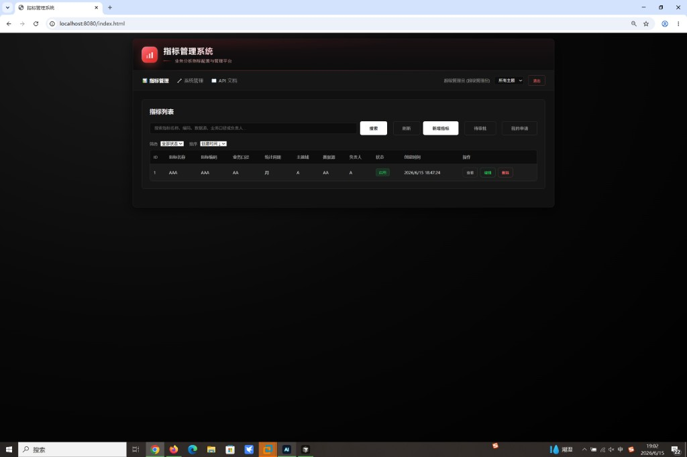
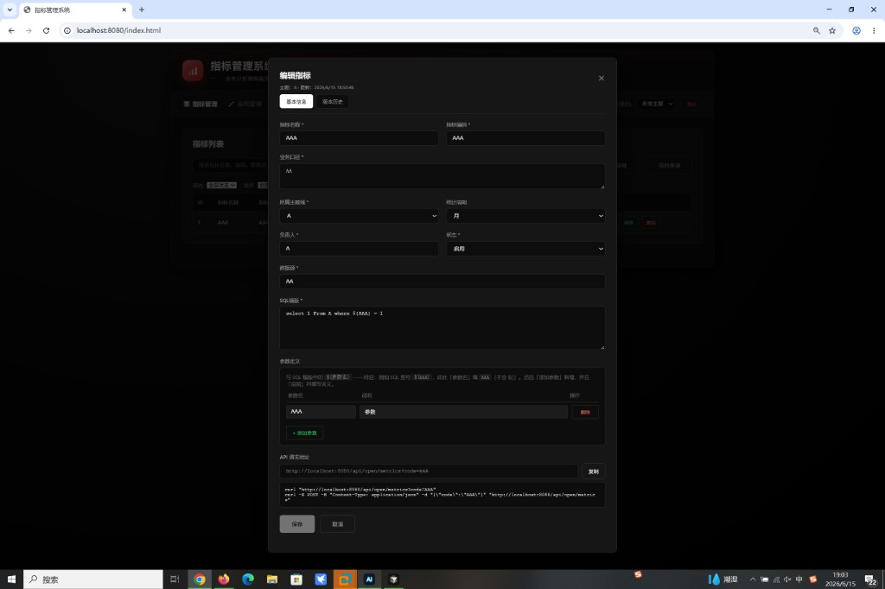
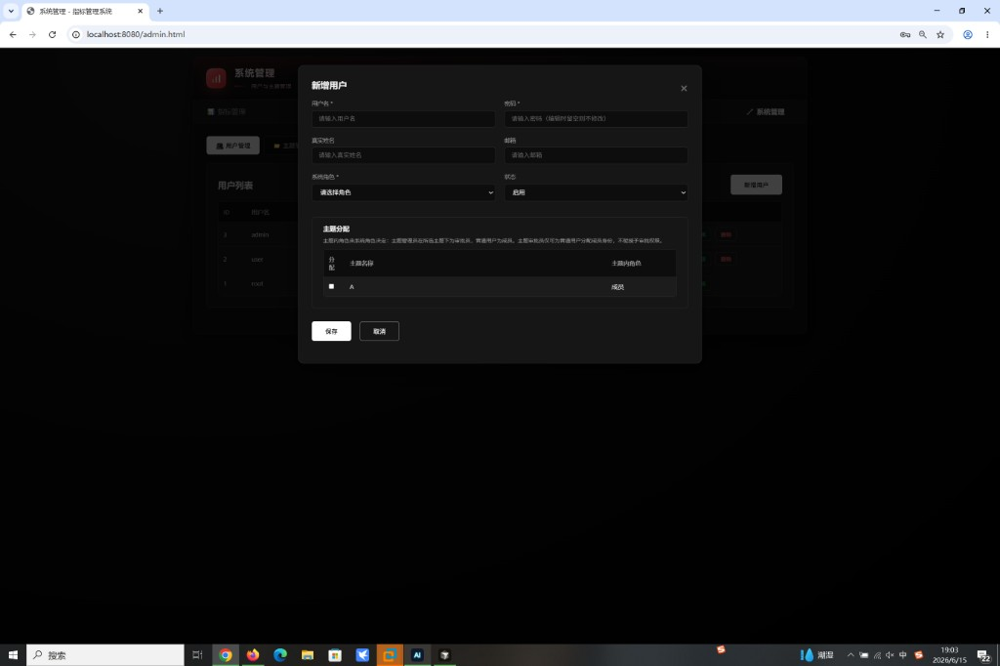

# 指标管理系统（sqldm v1.0.1）

业务分析指标的元数据管理平台：在前端配置指标定义（口径、SQL 模版、参数等），经审批后对外通过 Open API 供下游系统读取。

> 历史版本变更记录见 [readme_historyversion.md](./readme_historyversion.md)

---

## 功能预览

### 指标列表

指标管理首页：搜索、筛选、新增指标，以及待审批 / 我的申请入口。



### 编辑指标

配置指标基本信息、SQL 模版与参数定义；启用后自动生成 Open API 地址与 cURL 示例。



### 用户与主题分配

系统管理：创建用户、设置系统角色，并为普通用户分配主题（主题内角色由系统角色自动推导）。



---

## 1. 架构说明

### 1.1 总体架构

单体 Spring Boot 应用，前后端一体部署：

```
浏览器 (HTML/JS/CSS)
        │ HTTP + Session
        ▼
┌───────────────────────────────────────┐
│  Spring Boot  (org.sqldm)   :8080     │
│  ├─ controller   内部 REST API        │
│  ├─ openapi      对外 Open API        │
│  ├─ service      业务 / 审批 / 权限   │
│  ├─ repository   JPA 数据访问         │
│  └─ static       login / index / admin│
└───────────────────────────────────────┘
        │ JDBC
        ▼
   PostgreSQL (vectordb)
```

- **前端**：`src/main/resources/static/` 静态页面，由 Spring Boot 直接提供，无独立前端工程。
- **后端**：Java 21 + Spring Boot 3.2 + Spring Security + JPA。
- **数据库**：PostgreSQL；表结构**仅通过手工 SQL 初始化**，应用启动时 `ddl-auto: validate` 只做校验、不自动建表。

### 1.2 模块划分

| 包路径 | 职责 |
|--------|------|
| `org.sqldm.controller` | 登录、指标、主题、用户、审批等内部 API |
| `org.sqldm.openapi` | 对外 Open API（`/api/open/metrics`，无需登录） |
| `org.sqldm.service` | 业务逻辑、审批流、主题权限 |
| `org.sqldm.entity` / `repository` | 实体与持久化 |
| `org.sqldm.config` | Security、Jackson、OpenAPI 配置 |

### 1.3 数据库表（8 张）

| 表名 | 说明 |
|------|------|
| `sys_user` | 系统用户（物理删除，无 `is_deleted`） |
| `topic` | 主题域 |
| `user_topic` | 用户-主题分配（ADMIN=审批员，MEMBER=成员） |
| `metric_definition` | 指标定义 |
| `metric_version` | 启用状态下的版本快照 |
| `metric_audit_log` | 操作审计 |
| `metric_approval_request` | 新增/变更/删除审批单 |
| `metric_recent_access` | 最近访问记录 |

完整 DDL 见：`src/main/resources/sql/sqldm_v1.0_full_init.sql`

### 1.4 权限模型（简要）

| 角色 | 说明 |
|------|------|
| **超级管理员** `SUPER_ADMIN` | 用户/主题 CRUD、全部审批、删除指标 |
| **主题审批员** `UserTopic.ADMIN` | 在所负责主题内审批；可为普通用户分配主题（仅成员） |
| **普通用户** `USER` | 在所分配主题下创建/编辑指标（变更走审批）；无主题分配则不可编辑 |

> 系统角色 `TOPIC_ADMIN` 需超级管理员分配主题后，在主题内才具备审批员身份；不等于自动拥有审批权。

---

## 2. 启动说明

### 2.1 环境要求

- JDK **21**
- Maven **3.8+**
- PostgreSQL **14+**（推荐 16）

### 2.2 数据库配置

数据库连接通过**环境变量**或 `deploy/config.env` 配置，无需修改源码中的 `application.yml`：

| 变量 | 说明 | 示例 |
|------|------|------|
| `SPRING_DATASOURCE_URL` | JDBC 连接串 | `jdbc:postgresql://192.168.31.100:5432/vectordb` |
| `SPRING_DATASOURCE_USERNAME` | 用户名 | `root` |
| `SPRING_DATASOURCE_PASSWORD` | 密码 | `your_password` |
| `SERVER_PORT` | 服务端口（可选） | `8080` |

本地开发可直接设置环境变量，或使用 `deploy/config.env` + 启动脚本，详见 [deploy/DEPLOY.md](./deploy/DEPLOY.md)。

### 2.3 数据库初始化（必做，手工执行）

应用**不会**自动建表，首次部署或重置库时须由 DBA/运维**手工**执行初始化脚本。

**脚本路径：**

```
src/main/resources/sql/sqldm_v1.0_full_init.sql
```

**psql 示例：**

```bash
psql -h <数据库主机> -U <用户名> -d <库名> -f src/main/resources/sql/sqldm_v1.0_full_init.sql
```

如需清空重建（会删除 public 下所有对象）：

```bash
psql -h <主机> -U <用户> -d <库名> -c "DROP SCHEMA public CASCADE; CREATE SCHEMA public; GRANT ALL ON SCHEMA public TO public;"
psql -h <主机> -U <用户> -d <库名> -f src/main/resources/sql/sqldm_v1.0_full_init.sql
```

**初始化后默认账号：**

| 用户名 | 密码 | 角色 |
|--------|------|------|
| root | root | 超级管理员 |

### 2.4 编译与启动

**开发环境：**

```bash
cd sqldm
mvn clean package -DskipTests
mvn spring-boot:run
```

或直接运行主类 **`org.sqldm.Main`**（需在 IDE 或 shell 中设置 `SPRING_DATASOURCE_*` 环境变量）。

**生产 / 一键部署（Linux / Windows）：**

```bash
cp deploy/config.env.example deploy/config.env   # 填写外部数据库连接
./deploy/start.sh                                  # Windows: .\deploy\start.ps1
```

完整部署说明见 **[deploy/DEPLOY.md](./deploy/DEPLOY.md)**。

### 2.5 访问入口

| 页面 | URL |
|------|-----|
| 登录 | http://localhost:8080/login.html |
| 指标管理 | http://localhost:8080/index.html |
| 系统管理 | http://localhost:8080/admin.html |
| Swagger | http://localhost:8080/swagger-ui.html |
| 健康检查 | http://localhost:8080/actuator/health |

### 2.6 常见问题

| 现象 | 处理 |
|------|------|
| 启动报表不存在 / validate 失败 | 未执行初始化 SQL，先跑 `sqldm_v1.0_full_init.sql` |
| 登录提示用户不存在 | 确认连的是 `vectordb`，且 init 脚本已插入 root |
| 页面样式/逻辑是旧的 | `mvn process-resources` 后重启，浏览器 **Ctrl+F5** |
| 8080 端口占用 | 修改 `application.yml` 中 `server.port` 或结束占用进程 |

---

## 3. 功能说明

### 3.1 指标管理

- 指标字段：名称、编码、业务口径、统计周期、主题域、负责人、状态、数据源、SQL 模版、参数定义
- **名称**主题内唯一，**编码**全局唯一
- 状态：`DRAFT` 草稿 / `PENDING_APPROVAL` 待审批 / `ACTIVE` 启用 / `DISABLED` 停用 / `REJECTED` 已驳回
- 草稿下数据源、SQL 可暂空；启用/停用时必填
- SQL 模版支持 `${参数名}` 占位，参数定义与之对应
- 列表：搜索、主题/状态筛选、排序；编辑无实质修改时保存按钮禁用
- 版本历史与操作审计（启用指标保存时自动快照）
- 重复编码/同主题同名保存时返回 warnings

### 3.2 审批流

- 普通用户新增/变更/删除指标 → 主题**审批员**按主题审批
- **待我审批**、**我的申请**；驳回后可修改重提
- 待审期间指标锁定，不可编辑/删除
- 超级管理员可审批全部主题

### 3.3 主题与用户

- **超级管理员**：创建/编辑/删除主题；用户 CRUD；分配主题与系统角色
- **主题审批员**：仅可为**普通用户**分配自己负责的主题（成员身份）；不可改主题本身、不可授予审批权
- **root** 账号不可删除、不可改角色，可改密码
- 用户删除为**物理删除**

### 3.4 对外 Open API

- 路径：`GET/POST /api/open/metrics`
- **无需登录**；仅返回 `ACTIVE` 指标
- 按编码：`/api/open/metrics?code=指标编码`
- 按 ID：`/api/open/metrics?id=1`
- 按版本：`/api/open/metrics?code=xxx&version=2`
- 列表：`GET /api/open/metrics`

示例：

```bash
curl "http://localhost:8080/api/open/metrics?code=AAA"
```

### 3.5 其他

- 暗色主题 UI（`theme.css`）
- 指标编码格式可配置（默认大写字母+数字+下划线）
- API 自测脚本：`scripts/self-test.ps1`

---

## 技术栈

| 层次 | 技术 |
|------|------|
| 后端 | Spring Boot 3.2、Spring Security、Spring Data JPA |
| 数据库 | PostgreSQL |
| 前端 | 原生 HTML / CSS / JavaScript |
| 文档 | SpringDoc OpenAPI |
| 构建 | Maven，Java 21 |

## 项目结构（精简）

```
sqldm/
├── src/main/java/org/sqldm/     # 后端源码
├── src/main/resources/
│   ├── application.yml          # 数据源等配置
│   ├── sql/
│   │   └── sqldm_v1.0_full_init.sql   # ★ 数据库初始化脚本
│   └── static/                  # 前端页面
├── docs/images/                 # README 截图
├── deploy/                      # 一键部署脚本与说明
│   ├── DEPLOY.md                # ★ 部署文档（外部 DB + 手工 SQL）
│   ├── config.env.example       # 数据库连接模板
│   ├── start.sh / start.ps1
│   └── stop.sh  / stop.ps1
├── scripts/
│   ├── DbInit.java              # 本地开发辅助（可选，非部署必需）
│   └── self-test.ps1            # API 自测
├── README.md                    # 本文档（v1.0 使用说明）
└── readme_historyversion.md     # 历史版本更新记录
```
